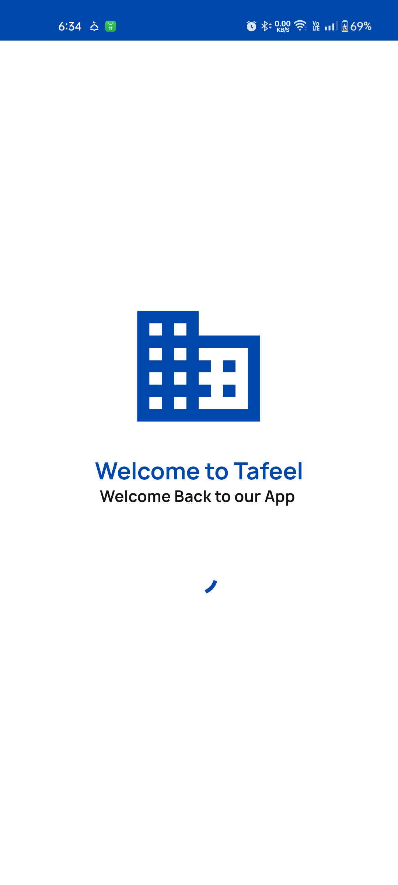
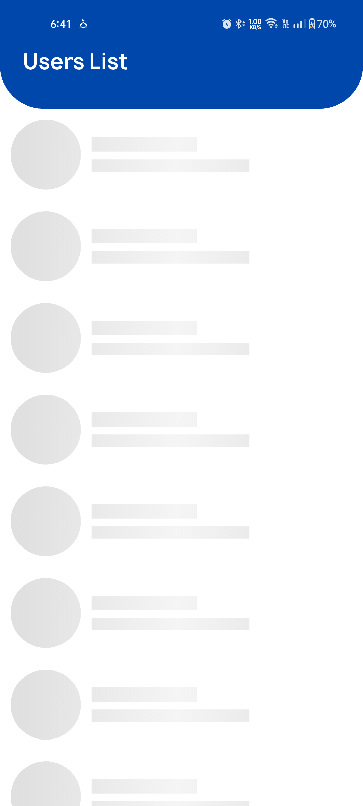
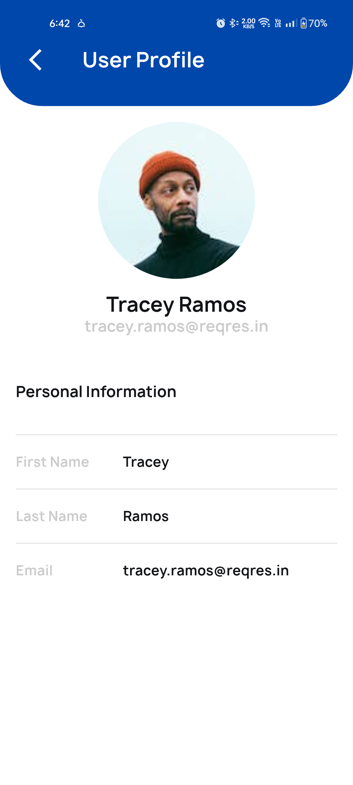

# Taf’eel Flutter Task

This repository contains the implementation of the technical task assigned by **Taf’eel Company**. The task demonstrates a clean and scalable Flutter architecture using best practices and modern development tools.

---

## 📱 Tech Stack

- **Flutter** – UI framework
- **Dio** – Networking and API handling
- **Provider** – State management
- **MVVM Architecture** – Clear separation of concerns (Model-View-ViewModel)
- **Clean Architecture** – Structured layers for data, domain, and presentation
- **flutter_screenutil** – Responsive design for different screen sizes
- **GetIt** – Dependency injection


---

## 📁 Project Structure

```text
lib/
├── core/
│   ├── resources/          # Constants, colors, fonts, sizes
│   ├── network/            # API client, interceptors
│   └── usecases/           # Base use case classes
│
├── data/                   # Data layer (models, API responses)
│
├── domain/                 # Domain layer (entities, repositories, use cases)
│
├── presentation/
│   ├── pages/              # UI screens with MVVM ViewModels
│   ├── widgets/            # Reusable UI components
│   └── components/         # Page-specific components
│
├── config/                 # Navigation and environment setup
├── main.dart

```

## ✅ Features Implemented
- **📄 User List Page** 

     - Fetch paginated users list

     - Pull-to-refresh and infinite scroll

     - Shimmer loading effect

- **👤 User Details Page**

   - Display detailed user information

  - Shimmer loading effect while data is loading

🌐 Networking

   - Dio configured with interceptors and error handling

🧠 Architecture

 - MVVM structure with Clean Architecture principles

📱 Responsive UI

- Used flutter_screenutil for scaling UI elements across devices


## 📷 Screenshots








